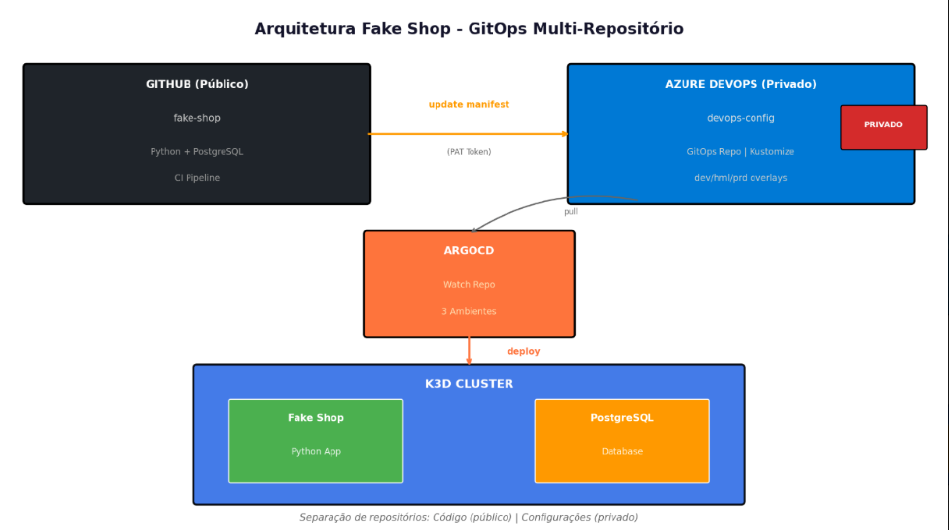
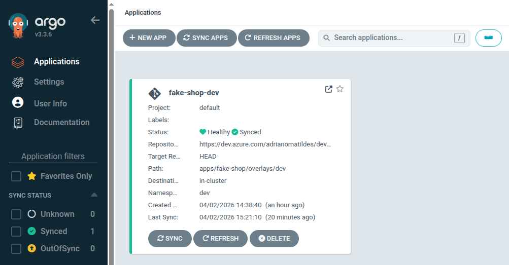
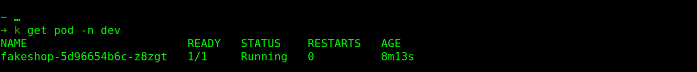

# Fake Shop

## Arquitetura & Deploy

### Arquitetura


*Fluxo multi-repo: GitHub (público) → Azure DevOps (privado) → ArgoCD → K3s*

### Stack
- **App:** Python Flask + PostgreSQL
- **CI:** GitHub Actions (build, test, push image)
- **CD:** ArgoCD sincronizando automaticamente
- **Infra:** K3s local com Kustomize overlays

### Fluxo de Deploy

| Branch | Ambiente | Namespace |
|--------|----------|-----------|
| `dev`  | Desenvolvimento | `dev` |
| `hml`  | Homologação | `hml` |
| `prd`  | Produção | `prd` |

Merge na branch dispara pipeline → atualiza `devops-config` → ArgoCD synca.

### Status do Ambiente


*ArgoCD: Healthy & Synced - 02/04/2026*


*Pod fake-shop rodando no namespace dev*

### Estrutura
├── src/                    # Código Python
├── k8s/                    # Manifests base
├── .github/workflows/      # CI Pipeline
└── docs/                   # Evidências

### Como Executar Local

**Opção 1: Deploy Direto (Demonstração Rápida)**
```bash
kubectl apply -k k8s/
kubectl port-forward svc/fake-shop 8080:80
curl localhost:8080
Teste
teste

```
### Opção 2: GitOps Completo
- Suba K3s e ArgoCD
- Configure acesso ao repo privado devops-config
- Aplique o ApplicationSet do devops-config

## Variável de Ambiente
| Variável                   | Descrição                             |
| -------------------------- | ------------------------------------- |
| `DB_HOST`                  | Host do PostgreSQL                    |
| `DB_USER`                  | Usuário do banco                      |
| `DB_PASSWORD`              | Senha do usuário                      |
| `DB_NAME`                  | Nome do database                      |
| `DB_PORT`                  | Porta (default 5432)                  |
| `FLASK_APP`                | Arquivo de inicialização (`index.py`) |
| `PROMETHEUS_MULTIPROC_DIR` | Diretório métricas (`/tmp/metrics`)   |
